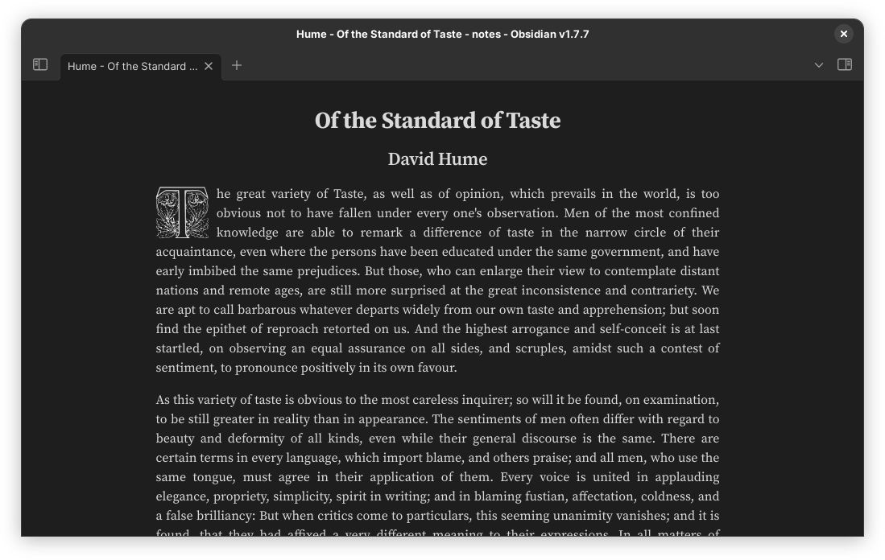

# Snippets

`Appearance.css` contains adjustments to make Obsidian blend in Gnome.

`Article.css` and `Drop caps.css` add `cssclasses` for optional styles. They are obtained by adding `cssclasses: article, dcaps` to the note properties (both shown in the picture).

The rest of the CSS improves consistency in the default theme and removes clutter.
