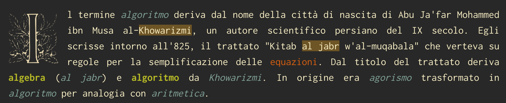
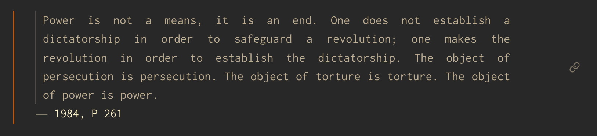
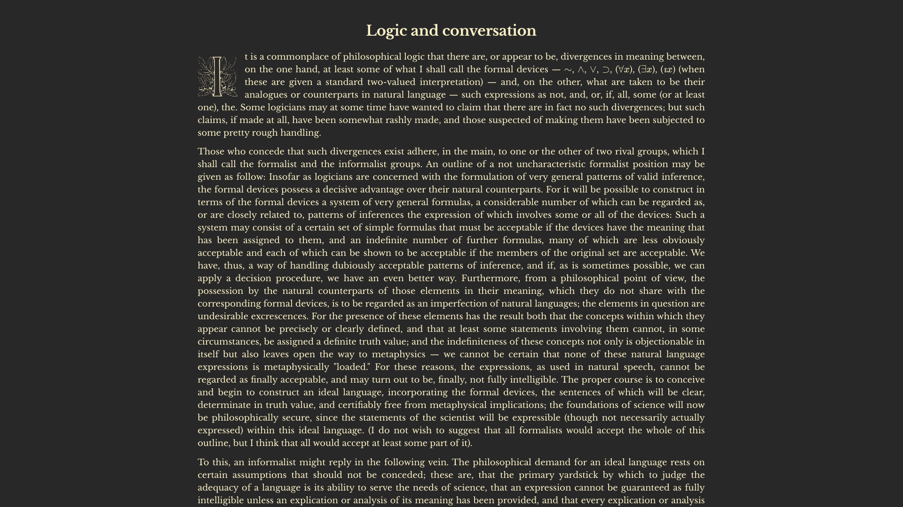

# Snippets

### Drop caps

This snippet implements [drop caps](https://en.wikipedia.org/wiki/Initial) in Obsidian. It works by assigning a specific font to a characted who has been given the 'dcaps' css class:

```html
<span class="dcaps">I</span>
```



This was inspired by [gwern.net](https://gwern.net/design#principles).

### Embeddable quotes

The style of the H6 header is similar to that of the quote block. In this way multiple quotes contained in multiple files across the vault can be individually embedded.

```markdown
![[quotes#Power is not a means, it is an end. One does not establish a dictatorship in order to safeguard a revolution; one makes the revolution in order to establish the dictatorship. The object of persecution is persecution. The object of torture is torture. The object of power is power.]]
```



### Images

Images have rounded corners, nice hover effect, shadows and they can be aligned.

```markdown
![[image.png|center|500]]
```


### Article

Scientific papers, blogposts, excerpts, etc., need to have a different style than the common note. `article.css` applies a custom font, shrinks the reading length and centers the headings.

Syntax:

```yaml
---
cssclass: article
---
```


